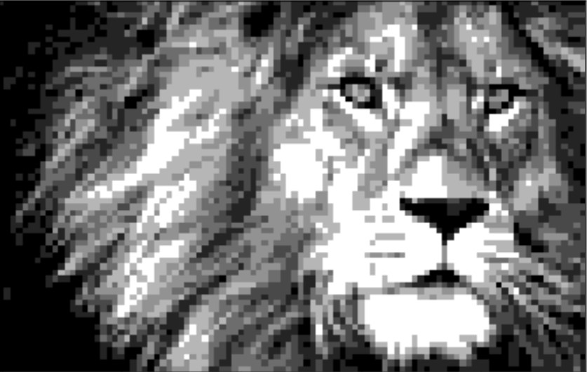
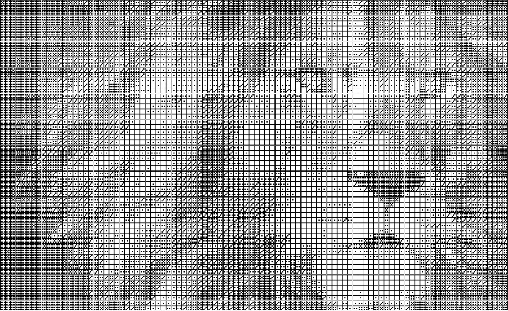

# Pixel Project
## Introduction

The program allows you to upload any image you want and create a new, pixelated image of the original image. You can control the size, the number of pixels and the number of shades of the image. Also, it is possible to get the image pixelated by playing dice, where the shade of the image is determined by the number on the dice.

### Example:

#### Original image:


#### Pixeled image:



#### Dice pixeled image:



## The program offers the following operations:

1. View the original image.

2. Display the pixelated image.

3. Save a CSV file of the pixelated image with numbers.

4. Draw and save the pixelated image as an ESP file using game cubes.

## Usage
To use the program, follow these steps:

#### 1. Install Git:

If you haven't already, download and install Git on your computer from the official website (https://git-scm.com/downloads). Follow the installation instructions specific to your operating system.

#### 2. Clone the Repository: 

Open a terminal or command prompt on your computer. Navigate to the directory where you want to download the repository. Use the following command to clone the repository:

```
git clone https://github.com/Itamar9494/pixel
```

#### 3. Navigate to the Repository: 

After cloning the repository, navigate to the repository's directory using the cd command in the terminal or command prompt:

```
cd <repository_directory>
```

Replace <repository_directory> with the name of the cloned repository's directory.

#### 4. Uploading Image:

Upload the image you want to pixelate to the `files` folder

#### 5. Run the code on "app" file 

Run the program by:
```
python app.py
```

The code will show you the names of all the images in the files folder.
     
Now, answer the following questions:
    
- Which image would you like to choose? Enter the corresponding number:    
    
- How many shades would you like for the picture? 

    Note: to draw the pixelated image as game cubes, choose a number less than or equal to 7.
    
- How would you like to choose the image size? 
 
    Based on the total number of pixels or by manually defining the number of rows and columns?
    
- How many pixels or how many rows and columns would you like?
    
- Would you like to see the original image?
    
- Would you like to see the pixelated image?
    
- Would you like to save the new image as a CSV file?
    
- Would you like to see and save the pixelated image as it is drawn by game cubes?
  
## Prerequisites


Open a terminal or command prompt on your computer, and run:

```
pip install -r requirements.txt
```

Additionally, download [EPS Viewer app](https://epsviewer.org/download.aspx) to open the EPS files containing the dice pixel images.
